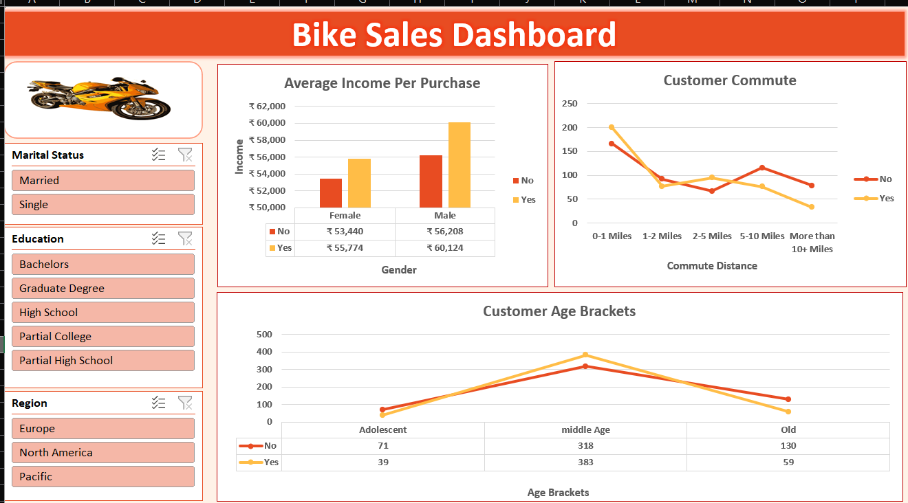
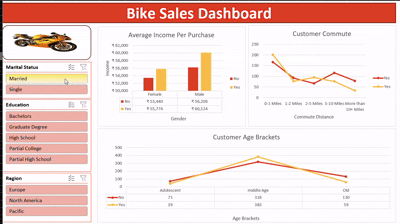

# 🚴‍♂️ Bike Sales Dashboard – Excel Project

This is a beginner-friendly Excel dashboard project I created by following a tutorial for practice and skill-building in Excel analytics.

---

## 🖼️ Dashboard Preview

---

🎥 Tutorial followed:  
[**Full Project in Excel | Excel Tutorials for Beginners** by Alex The Analyst](https://youtu.be/opJgMj1IUrc?si=ViakrWW-ekNjxfcE)  
> *The tutorial walks through the data cleaning process and dashboard creation in Excel.*

---

## 📌 Project Overview

The **Bike Sales Dashboard** displays key insights about customer demographics and purchase behavior using:

- **PivotTables**  
- **PivotCharts**  
- **Slicers** for filtering  
- A clean, organized dashboard layout  

---

## 📊 Key Visuals Included

- **Average Income by Gender**  
- **Customer Age Groups**  
- **Commute Distances**  
- Slicers for:  
  - Marital Status  
  - Education Level  
  - Region  

---

## 🧠 Skills Practiced

- Data cleaning and preparation  
- PivotTable and PivotChart creation  
- Dashboard design and layout formatting  
- Slicer integration for interactivity  
- Translating raw data into readable insights  

---

## 📂 Files Included

- `Bike_Sales_Dashboard.xlsx` – The completed Excel dashboard  
- `README.md` – This documentation  

---

## 🎯 Purpose

This project was part of my practice to reinforce the **foundations of Excel data analysis and dashboard creation**. It helped me understand how to structure a dashboard and build interactivity into Excel reports.

---

## 🙏 Credits

- Tutorial by: [Excel Tutorials for Beginners – YouTube](https://youtu.be/opJgMj1IUrc?si=buY2A3hbCXgIqBOO)

---

> Feedback is always welcome!  
> This is one of my early projects — more advanced dashboards coming soon.

